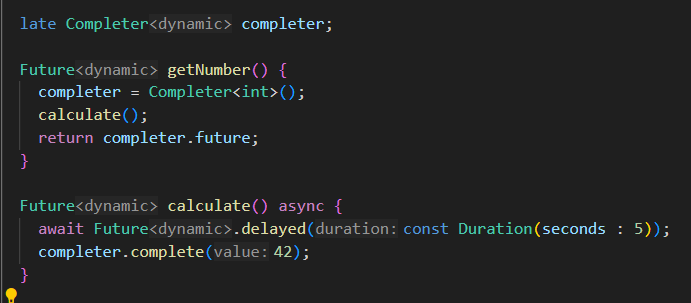

# Praktikum 1
## Langkah 1

## Langkah 2

## Langkah 3

## Langkah 4

## Langkah 5   

# Praktikum 2
## Langkah 1   

## Langkah 2 

## Langkah 3 

## Langkah 4   

# Praktikum 3
## Langkah 1

## Langkah 2   

## Langkah 3   

## Langkah 4   

## Langkah 5   

## Langkah 6   

# Praktikum 4
## Langkah 1   

## Langkah 2   

## Langkah 3   

## Langkah 4   

# Praktikum 5
## Langkah 1   

## Langkah 2   

## Langkah 3   

## Langkah 4   

# Praktikum 6
## Langkah 1 

## Langkah 2 

## Langkah 3 

## Langkah 4 

## Langkah 5 

## Langkah 6 

## Langkah 7 

## Langkah 8 

# Praktikum 7
## Langkah 1 

## Langkah 2 

## Langkah 3 

## Langkah 4 

## Langkah 5 

# Praktikum 8
## Langkah 1 

## Langkah 2 

## Langkah 3 

## Langkah 4 

## Langkah 5 

## Langkah 6 

## Langkah 7 

# Praktikum 9
## Langkah 1 

## Langkah 2 

## Langkah 3 

## Langkah 4 

## Langkah 5 

## Langkah 6 

# Soal
## Soal 1 

## Soal 2 

## Soal 3 

## Soal 4 

## Soal 5 

## Soal 6 

## Soal 7 

<video src="Images/soal 7.mp4" width="400" controls></video>

## Soal 8 

## Soal 9 

<video src="Images/Soal 9.mp4" width="400" controls></video>

## Soal 10 

<video src="Images/Soal 10.mp4" width="400" controls></video>

## Soal 11

<video src="Images/Soal 11.mp4" width="400" controls></video>

## Soal 12 

<video src="Images/Soal 12.mp4" width="400" controls></video>

## Soal 13 

<video src="Images/Soal 13.mp4" width="400" controls></video>

## Soal 14 

<video src="Images/Soal 14.mp4" width="400" controls></video>

## Soal 15 

## Soal 16 

<video src="Images/Soal 16.mp4" width="400" controls></video>

## Soal 17 

<video src="Images/Soal 17.mp4" width="400" controls></video>

